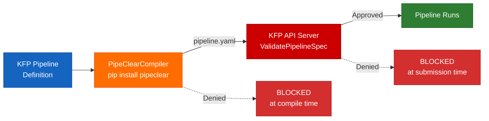
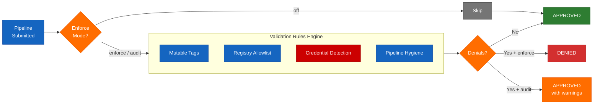
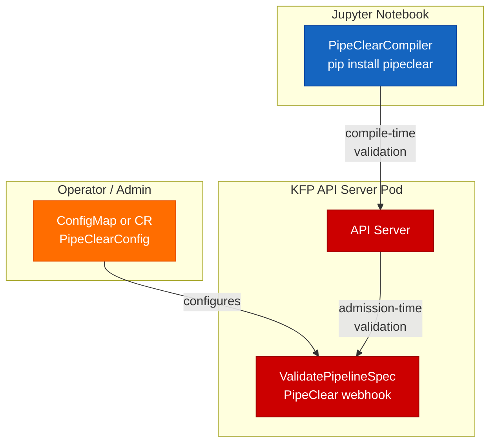

# PipeClear

**Pipeline pre-flight validation for [Kubeflow Pipelines](https://www.kubeflow.org/docs/components/pipelines/).**

Works with upstream KFP, [OpenDataHub](https://opendatahub.io/), and [Red Hat OpenShift AI](https://www.redhat.com/en/technologies/cloud-computing/openshift/openshift-ai).

PipeClear catches pipeline issues (unauthorized registries, mutable tags, hardcoded credentials, policy violations) **before** they run. Two layers of defense: compile-time in the notebook, and admission-time on the cluster.

Available as both a **Python library** (`pip install pipeclear`) and a **Go library** (`go get github.com/ugiordan/pipeclear`).

## Why

Data scientists build ML pipelines using the [KFP SDK](https://www.kubeflow.org/docs/components/pipelines/), compile them to YAML (the KFP Intermediate Representation), and submit them to the KFP API Server for execution.

When something goes wrong (a `:latest` tag, a leaked API key, an unauthorized registry) the failure happens **after** the pipeline is already running. Each failure wastes 10-30 minutes in submit-wait-fail cycles.

PipeClear shifts validation left:



## Two-Layer Architecture

### Layer 1: Python SDK (`pip install pipeclear`)

Wraps the KFP compiler with pre-flight validation. Catches issues at compile time in the notebook, before pipeline YAML is created.

```python
from pipeclear.kfp import PipeClearCompiler

compiler = PipeClearCompiler(
    allowed_registries=["registry.redhat.io", "quay.io/myorg"],
    block_mutable_tags=True,
    block_inline_credentials=True,
)
compiler.compile(my_pipeline, "pipeline.yaml")
```

### Layer 2: Go Library (`go get github.com/ugiordan/pipeclear`)

Standalone validation engine that accepts raw KFP pipeline spec JSON. Used by the KFP API Server webhook for admission-time validation, but importable by any Go project in the KFP ecosystem.

```go
import "github.com/ugiordan/pipeclear/pkg/pipeclear"

config, _ := pipeclear.LoadConfig("pipeclear.yaml")
result, err := pipeclear.SafeValidate(specJSON, config)
if len(result.Denials) > 0 {
    // Pipeline blocked at submission time
}
```

## Validation Rules



| Rule | What it catches | Severity |
|------|----------------|----------|
| **Mutable Tags** | `:latest` or missing tags on container images | Warning |
| **Registry Allowlist** | Images from unauthorized registries | Denial |
| **Credential Detection** | Hardcoded API keys, tokens, PEM keys in env vars or args | Denial |
| **Denied Env Vars** | Env var names matching secret patterns (`_PASSWORD`, `_TOKEN`, etc.) | Denial |
| **Max Tasks** | Pipelines exceeding task count limit (default: 100) | Denial |
| **Digest Pinning** | Images not pinned by `@sha256:` digest | Warning |
| **Semver Tags** | Non-semver image tags | Warning |
| **Resource Limits** | Missing CPU/memory limits on executors | Warning |
| **Duplicate Tasks** | Identical executor configurations | Warning |

## Enforce Modes

Three operational modes for gradual rollout:

| Mode | Behavior | Use case |
|------|----------|----------|
| **enforce** (default) | Denials block pipeline submission | Production: policy compliance is mandatory |
| **audit** | Denials converted to `[AUDIT]` warnings, pipeline proceeds | Rollout: tune policies before enforcing |
| **off** | All validation skipped | Development or emergency bypass |

## Shared Configuration

Both Go and Python consume the same YAML config format:

```yaml
# pipeclear.yaml
mode: enforce                    # enforce | audit | off
allowedRegistries:               # empty or omitted = all allowed
  - registry.redhat.io
  - quay.io/myorg
blockMutableTags: true           # warn on :latest or missing tags
blockInlineCredentials: true     # detect hardcoded secrets
maxTasks: 100                    # 0 = unlimited
deniedEnvVarPatterns:            # env var name suffixes to deny
  - _PASSWORD
  - _SECRET
  - _TOKEN
  - _API_KEY
warnDigestPinning: false         # opt-in: warn on missing @sha256:
warnSemverTags: false            # opt-in: warn on non-semver tags
warnResourceLimits: false        # opt-in: warn on missing CPU/mem limits
warnDuplicateTasks: true         # warn on identical executor configs
```

Field names use camelCase (Go convention). Python maps them to snake_case internally.

### Loading config in Python

```python
from pipeclear.kfp import PipeClearCompiler

# From YAML file
compiler = PipeClearCompiler.from_config("pipeclear.yaml")

# With overrides
compiler = PipeClearCompiler.from_config("pipeclear.yaml", mode="audit")

# Or inline kwargs (existing API, unchanged)
compiler = PipeClearCompiler(
    allowed_registries=["quay.io/myorg"],
    block_mutable_tags=True,
)
```

### Loading config in Go

```go
import "github.com/ugiordan/pipeclear/pkg/pipeclear"

// From YAML file
config, err := pipeclear.LoadConfig("pipeclear.yaml")

// From raw bytes (e.g. loaded from a ConfigMap)
config, err := pipeclear.ParseConfig(configMapData)

// Defaults
config := pipeclear.DefaultConfig()
```

## Quick Start

### Python

```bash
pip install -e ".[dev]"
```

```python
from kfp import dsl
from pipeclear.kfp import PipeClearCompiler

@dsl.pipeline(name="training-pipeline")
def my_pipeline():
    train = dsl.ContainerOp(
        name="train",
        image="quay.io/myorg/trainer:v1.2.3",
    )

compiler = PipeClearCompiler()
compiler.compile(my_pipeline, "pipeline.yaml")
```

### Go

```bash
go get github.com/ugiordan/pipeclear/pkg/pipeclear
```

```go
config := pipeclear.DefaultConfig()
config.AllowedRegistries = []string{"registry.redhat.io", "quay.io/myorg"}

result, err := pipeclear.Validate(pipelineSpecJSON, config)
for _, d := range result.Denials {
    fmt.Println("DENIED:", d)
}
```

### CLI

```bash
pipeclear analyze notebook.ipynb
pipeclear analyze notebook.ipynb --format json
pipeclear analyze notebook.ipynb --config pipeclear.yaml
```

## Deployment Model



Zero new pods. Reuses the existing operator-managed API server binary and certificates. Configuration flows through:
- **Upstream KFP:** ConfigMap in the KFP namespace
- **OpenDataHub / RHOAI:** `DataSciencePipelinesApplication` (DSPA) CR via the DSPO operator, giving platform admins per-namespace control

## Server-Side Integration

The server-side validation is implemented in a [fork of data-science-pipelines](https://github.com/ugiordan/data-science-pipelines/tree/feat/pipeclear-validation) (`feat/pipeclear-validation` branch), adding two files to the existing webhook package:

```
backend/src/apiserver/webhook/
├── pipelineversion_webhook.go      # Existing: validates PipelineVersion CRs
├── pipelineversion_webhook_test.go  # Existing
├── pipeclear.go                     # NEW: validation rules engine
└── pipeclear_test.go                # NEW: 31 test functions
```

**How it works:**

1. The KFP API Server already runs a `ValidatingWebhookConfiguration` for `PipelineVersion` custom resources. PipeClear hooks into this existing path
2. When a pipeline is submitted, the webhook deserializes the KFP IR (protobuf), extracts the `DeploymentSpec`, and iterates over each executor's container spec
3. `SafeValidatePipelineSpec` wraps validation with panic recovery so a bug in validation never crashes the API server
4. Configuration flows from a ConfigMap (upstream) or DSPA CR (OpenDataHub/RHOAI), giving platform admins per-namespace control

No new Deployments, Services, or TLS certificates. The validation runs in-process with sub-millisecond overhead.

**KEP:** [kubeflow/pipelines#13151](https://github.com/kubeflow/pipelines/issues/13151) | **PR:** [kubeflow/pipelines#13156](https://github.com/kubeflow/pipelines/pull/13156)

## Test Coverage

- **Go Library:** 22 test functions, all passing
- **Server-Side Validation (Go):** 31 test functions, all passing
- **Python SDK:** 48 test functions, all passing

## Development

```bash
# Python
pytest tests/ -v
pytest --cov=pipeclear tests/

# Go
go test ./pkg/pipeclear/ -v
```

## License

Apache License 2.0. See [LICENSE](LICENSE).

---

Built with the assistance of [Claude](https://claude.ai) (Anthropic).
